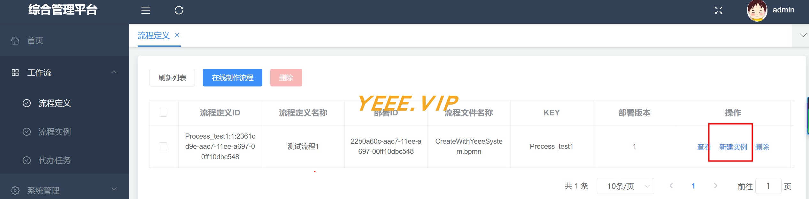
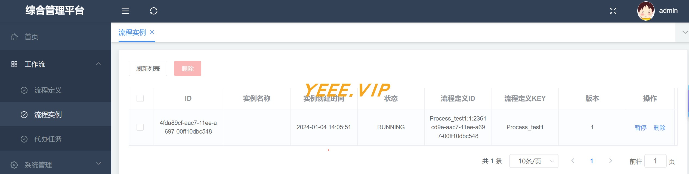
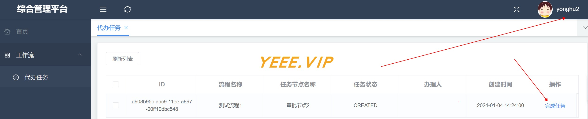
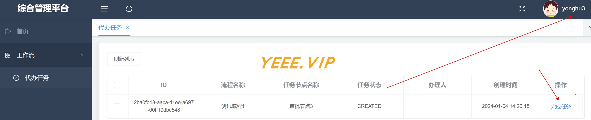
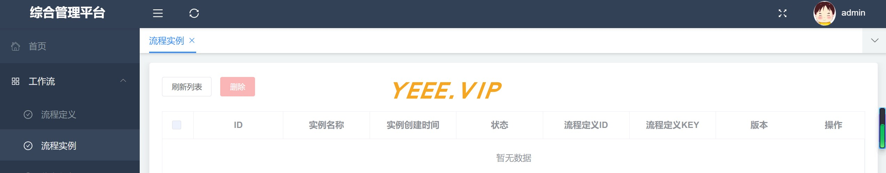

## 系统说明

- 基于 Spring Boot2.6 + + SpringSecurity + Activiti7 + Vue 搭建的 **工作流系统**
- 轻量级 + 组件化 + 可扩展

## 项目演示

### 演示账号/密码

1. admin/111111，超级管理员，可以绘制流程定义，创建审批任务
2. yonghu1/111111，部门1（bumeng1）的普通用户，审批任务
3. yonghu2/111111，部门2（bumeng2）的普通用户，审批任务
4. yonghu3/111111，部门3（bumeng3）的普通用户，审批任务

### 在线绘制流程定义

登录admin账号，进入菜单 - 工作流 > 流程定义 > 在线制作流程

- 审批节点1，候选组 = bumeng1
- 审批节点2，候选组 = bumeng2
- 审批节点3，候选组 = bumeng3


### 创建/查看审批流程

登录admin账号，进入菜单 - 工作流 > 流程定义 > (列表中找到‘测试流程1’这个审批流程) > 新建实例，这样就开启了一个审批流程。



管理员admin也可以进去菜单 - 工作流 > 流程实例 > (查看到正在运行/暂停的审批流程)



### 任务审批

流程定义在不同的审批环节设置了不同部门的人员来审批，开始流程实例后，人员就可以登录自己账号进入菜单 - 工作流 > 代办任务 > 查看到自己当前的待完成审批项。

#### 部门1用户1审批

用户1登录自己的账号yonghu1完成审批


#### 部门2用户2审批

用户2登录自己的账号yonghu2完成审批



#### 部门3用户3审批

用户3登录自己的账号yonghu3完成审批



### 再次查看审批流程

登录admin账号，进入菜单 - 工作流 > 流程定义 > 列表中的‘测试流程1’这个审批流程不在了，说明已经完成结束了



## 快速开始

### 核心依赖

| 依赖                          | 版本                                                   |
|-----------------------------|------------------------------------------------------|
| Spring Boot                 | 2.6.3                                                |
| yeee-memo                   | [通用web脚手架](https://gitee.com/yeeevip/yeee-memo.git) |

### 模块说明

```lua
yeee-activiti7
├── app-h5
    ├── yeee-admin-ui -- 管理系统｜vue
    └── activiti-editor -- 工作流绘制器
├── doc -- 文档脚本
├── yeee-app-bootstrap -- 主启动工程
├── yeee-app-common -- 公共模块
├── yeee-sys-manage -- 系统权限管理服务
```

### 本地开发 运行

#### 环境要求

- jdk1.8
- mysql >= 5.7

```
# 下载yeee-memo脚手架工程
git clone https://github.com/yeeevip/yeee-memo.git

# 打包[JavaWeb通用脚手架]
cd yeee-memo/memo-parent && mvn clean install

# 下载yeee-activiti7项目
git clone https://github.com/yeeevip/yeee-activiti7.git

# 运行管理端ui
cd yeee-activiti7/app-h5/yeee-admin-ui && npm install && npm run dev

# 编译流程制作ui
cd yeee-activiti7/app-h5/activiti-editor && npm install && npm run all

# 运行博客服务
cd yeee-activiti7 && mvn clean install && java -jar yeee-activiti7-bootstrap/target/yeee-activiti7-bootstrap-1.0.0-SNAPSHOT.jar
```

### 其他说明

1. 欢迎提交 [PR](https://www.yeee.vip)

2. 欢迎提交 [issue](https://gitee.com/yeeevip/yeee-blog/issues)，请写清楚遇到问题的原因、开发环境、复显步骤。

## 交流群

- 作者QQ：1324459373

| 微信群                             | QQ群                                                                           |
|---------------------------------|-------------------------------------------------------------------------------|
|  |                                               |
| 回复：加群，邀您加入群聊                    | <a href="https://qm.qq.com/q/oLSCm1Ksjm" target="_blank">点击加入QQ群：96305921</a> |

