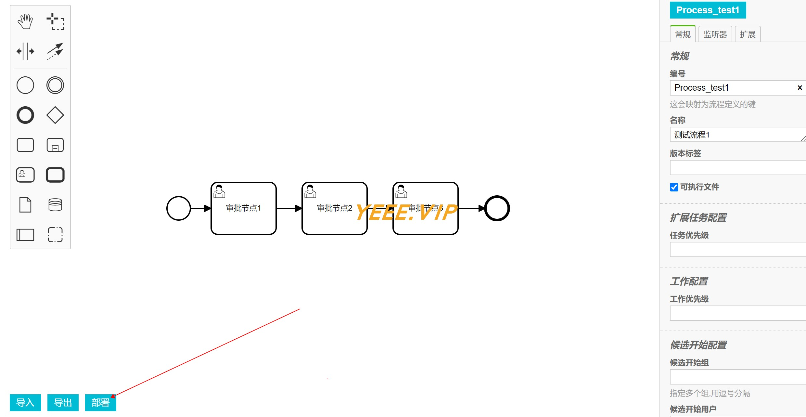

## 系统说明

- 基于 Spring Boot + Vue + activiti7 开发的 **工作流系统**
- 轻量级 + 组件化 + 可扩展

### 工作流管理


### 绘制工作流



## 快速开始

### 核心依赖

| 依赖                          | 版本                                                   |
|-----------------------------|------------------------------------------------------|
| Spring Boot                 | 2.6.3                                                |
| yeee-memo                   | [通用web脚手架](https://gitee.com/yeeevip/yeee-memo.git) |

### 模块说明

```lua
yeee-activiti7
├── app-h5
    ├── yeee-admin-ui -- 管理系统｜vue
    └── activiti-editor -- 工作流绘制器
├── doc -- 文档脚本
├── yeee-app-bootstrap -- 主启动工程
├── yeee-app-common -- 公共模块
├── yeee-sys-manage -- 系统权限管理服务
```

### 本地开发 运行

#### 环境要求

- jdk1.8
- mysql >= 5.7
- redis

```
# 下载yeee-memo工程
git clone https://github.com/yeeevip/yeee-memo.git

# 打包[JavaWeb通用脚手架]
cd memo-parent && mvn clean install

# 下载yeee-activiti7项目
git clone https://github.com/yeeevip/yeee-blog.git

# 运行管理端ui
cd app-h5/yeee-admin-ui && npm install && npm run dev

# 运行博客客户端ui
cd app-h5/activiti-editor && npm install && npm run all

# 运行博客服务
mvn clean install && java -jar -Dspring.profiles.active=test yeee-app-bootstrap/target/yeee-activiti7-bootstrap-1.0.0-SNAPSHOT.jar
```

### 其他说明

1. 欢迎提交 [PR](https://www.yeee.vip)，注意对应提交对应 `blog-dev` 分支

2. 欢迎提交 [issue](https://gitee.com/yeeevip/yeee-blog/issues)，请写清楚遇到问题的原因、开发环境、复显步骤。

## 交流群

- 作者QQ：1324459373

| 微信群                             | QQ群                                                                           |
|---------------------------------|-------------------------------------------------------------------------------|
|  |                                               |
| 回复：加群，邀您加入群聊                    | <a href="https://qm.qq.com/q/oLSCm1Ksjm" target="_blank">点击加入QQ群：96305921</a> |

